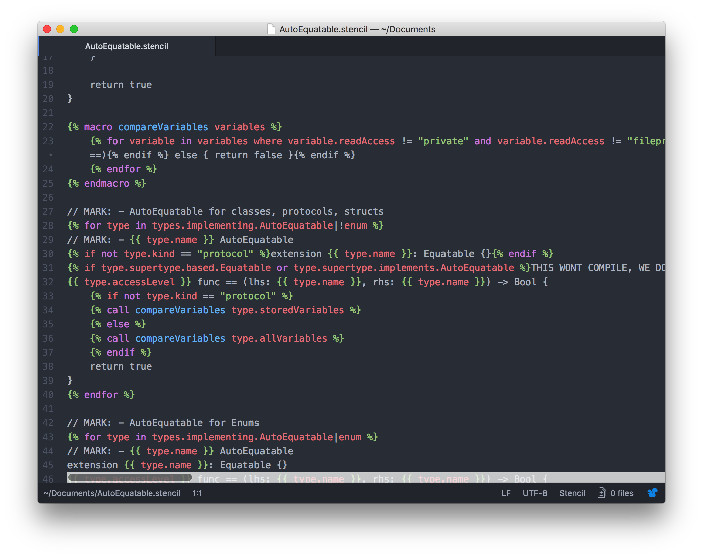

# [Stencil](https://github.com/kylef/Stencil) language support for [Atom](https://atom.io)

Just adds Stencil syntax highlighting to Atom text editor. [StencilSwiftKit](https://github.com/SwiftGen/StencilSwiftKit) extensions are also supported.

## Installation

- In Atom, go to Settings (`cmd-,`) -> Install -> Search `Stencil`.
- Or, run `apm install language-stencil`.

## Screenshot

