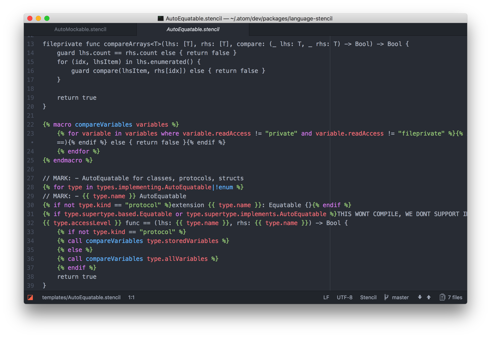

# [Stencil](https://github.com/kylef/Stencil) language support for Atom

Just adds Stencil syntax highlighting to [Atom](https://atom.io) text editor. [StencilSwiftKit](https://github.com/SwiftGen/StencilSwiftKit) extensions are supported too.

## Installation

- In Atom, go to Settings (`cmd-,`) -> Install -> Search `Stencil`.
- Or, run `apm install language-stencil`.

## Screenshot

